<!-- TOC -->

- [1. Linux单机安装](#1-linux单机安装)
    - [1.1. 下载&安装](#11-下载安装)
        - [1.1.1. 环境需求](#111-环境需求)
        - [1.1.2. 下载](#112-下载)
        - [1.1.3. 安装](#113-安装)
        - [1.1.4. 修改配置文件](#114-修改配置文件)
        - [1.1.5. 启动&验证结果](#115-启动验证结果)
        - [1.1.6. 可视化工具](#116-可视化工具)
    - [1.2. 中文分词插件IK](#12-中文分词插件ik)
        - [1.2.1. 安装](#121-安装)
        - [1.2.2. ik_max_word和ik_smart](#122-ik_max_word和ik_smart)
            - [1.2.2.1. ik_smart分词](#1221-ik_smart分词)
            - [1.2.2.2. ik_max_word分词](#1222-ik_max_word分词)
    - [1.3. 索引](#13-索引)
        - [1.3.1. 创建索引](#131-创建索引)
            - [1.3.1.1. 官方例子说明](#1311-官方例子说明)
            - [1.3.1.2. 自定义索引](#1312-自定义索引)
        - [1.3.2. 查看索引](#132-查看索引)
            - [1.3.2.1. 全部索引](#1321-全部索引)
            - [1.3.2.2. 条件查询](#1322-条件查询)
        - [1.3.3. 查看索引分词器](#133-查看索引分词器)
        - [1.3.4. 修改索引](#134-修改索引)
        - [1.3.5. 删除索引](#135-删除索引)
    - [1.4. 如何数据管理](#14-如何数据管理)
        - [1.4.1. 添加数据](#141-添加数据)
        - [1.4.2. 基础查询](#142-基础查询)
            - [1.4.2.1. 查询所有](#1421-查询所有)
            - [1.4.2.2. 条件查询](#1422-条件查询)
        - [1.4.3. 高级条件查询](#143-高级条件查询)
            - [1.4.3.1. 权重boost查询](#1431-权重boost查询)
            - [1.4.3.2. 过滤coerce查询](#1432-过滤coerce查询)
                - [1.4.3.2.1. 创建索引](#14321-创建索引)
                - [1.4.3.2.2. 创建第一个数据](#14322-创建第一个数据)
                - [1.4.3.2.3. 创建第二个数据](#14323-创建第二个数据)
            - [1.4.3.3. copy_to](#1433-copy_to)
                - [1.4.3.3.1. 定义索引](#14331-定义索引)
                - [1.4.3.3.2. 新增数据](#14332-新增数据)
                - [1.4.3.3.3. 查询数据](#14333-查询数据)
            - [1.4.3.4. doc_values](#1434-doc_values)
            - [1.4.3.5. dynamic](#1435-dynamic)
- [2. 构建集群模式](#2-构建集群模式)
- [3. 源码](#3-源码)

<!-- /TOC -->

# 1. Linux单机安装

题外话，这一章节仅仅作为开发学习来构建基础的环境，并未考虑elasticsearch的高可用性，仅说明一些基础知识，带大家有一个认识。当然既然是自我发挥，也就是一家之言，难免有遗漏地方，希望大家也就本着看看。

## 1.1. 下载&安装

### 1.1.1. 环境需求

- CentOs7
- 内存4G+

### 1.1.2. 下载

[官方elasticsearch下载](https://github.com/rothschil/weathertop/tree/master/akkad-springboot/springboot-elasticsearch)，下载elasticsearch，目前最新的稳定版本为 7.4.0 版本。

我这边机器JDK版本是11，低于JDk9会有一些问题。

~~~

Java HotSpot(TM) 64-Bit Server VM warning: Option UseConcMarkSweepGC was deprecated in version 9.0 and will likely be removed in a future release.

~~~

### 1.1.3. 安装

~~~

[root@localhost download]$ pwd
/data/download/

[root@localhost download]$ wget https://artifacts.elastic.co/downloads/elasticsearch/elasticsearch-7.4.0-linux-x86_64.tar.gz

[root@localhost download]$ cd ../app/

[root@localhost app]$ mkdir elastic

[root@localhost app]$ useradd elastic -g dev

[root@localhost app]$ passwd elastic

[root@localhost app]$ chown -R elastic:dev elastic

[root@localhost app]$ su elastic

[elastic@localhost app]$ cd /elastic

[elastic@localhost elastic]$ cp ../../download/elasticsearch-7.4.0-linux-x86_64.tar.gz .

[elastic@localhost elastic]$ tar -zxvf elasticsearch-7.4.0-linux-x86_64.tar.gz

[elastic@localhost elastic]$ mv elasticsearch-7.4.0/ .

~~~

### 1.1.4. 修改配置文件

路径config/elasticsearch.yml

~~~
-- 允许外部IP访问
network.host: 0.0.0.0

-- 把这个注释先放开
cluster.initial_master_nodes: ["node-1", "node-2"]
~~~

### 1.1.5. 启动&验证结果

- 启动

~~~
[elastic@localhost elastic]$ ./bin/elasticsearch
~~~

- 验证结果

Elastic会在默认9200端口运行，打开地址：http://192.168.147.132:9200/

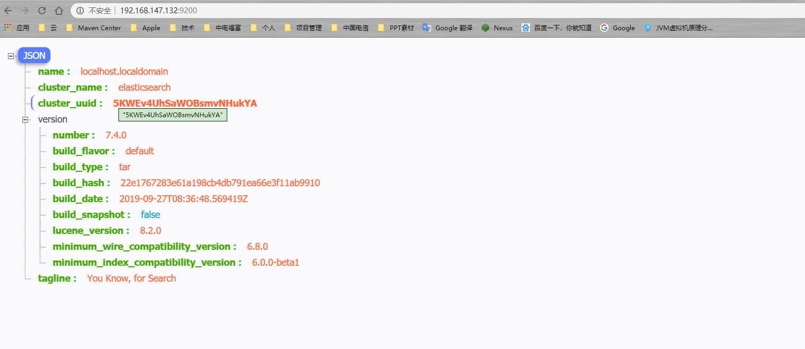

### 1.1.6. 可视化工具

ElasticSearch的可视化工具有很多，比如elasticsearch-head、Dejavu、ElasticHD等。

选择版本，下载，为了演示需要，我用的是:

https://github.com/360EntSecGroup-Skylar/ElasticHD/releases/download/1.4/elasticHD_linux_amd64.zip

~~~
1、unzip elasticHD_linux_amd64.zip

2、chmod -R 777 ElasticHD

3、./ElasticHD -p 0.0.0.0:9800

~~~

## 1.2. 中文分词插件IK

### 1.2.1. 安装

ik插件地址： https://github.com/medcl/elasticsearch-analysis-ik，为了演示需要，这里选择wget方式。

- 下载
~~~
[root@localhost download]$ wget https://github.com/medcl/elasticsearch-analysis-ik/releases/download/v7.4.0/elasticsearch-analysis-ik-7.4.0.zip
~~~

- 安装插件

~~~
[elastic@localhost elastic]$ cd plugins

[elastic@localhost plugins]$ cd mkdir ik && cd ik

[elastic@localhost ik]$ cp ../../../download/elasticsearch-analysis-ik-7.4.0.zip .

[elastic@localhost ik]$ unzip elasticsearch-analysis-ik-7.4.0.zip
~~~

完成后重启es

- 验证分词器

使用crul命令，输入下面的URL地址，验证分词器是否成功。
~~~
[elastic@localhost elastic]$ curl -X GET -H "Content-Type: application/json"  "http://localhost:9200/_analyze?pretty=true" -d'{"text":"中华五千年华夏"}';
~~~

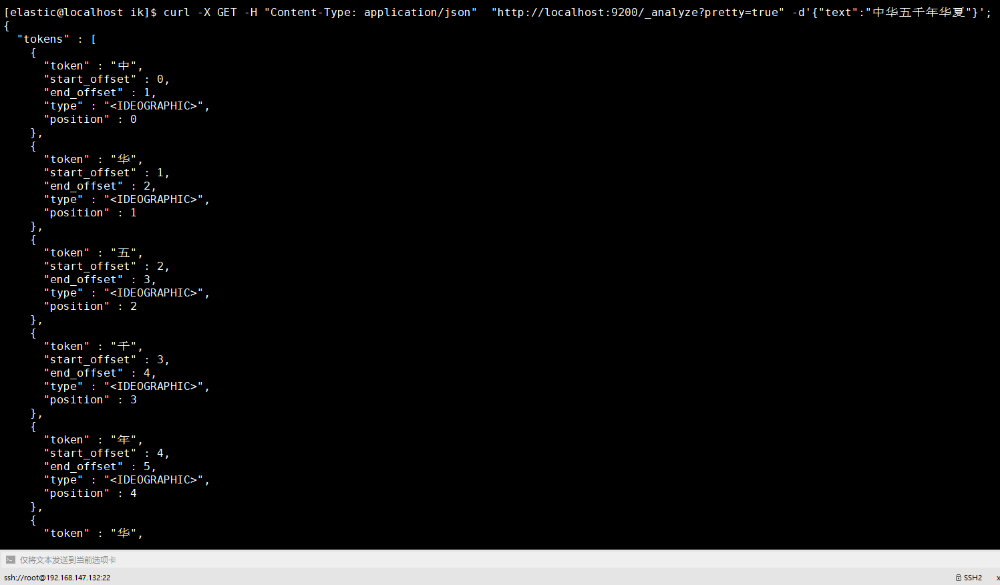

### 1.2.2. ik_max_word和ik_smart

- **ik_max_word**: 将文本按最细粒度的组合来拆分，比如会将“中华五千年华夏”拆分为“五千年、五千、五千年华、华夏、千年华夏”，总之是可能的组合；

- **ik_smart**: 最粗粒度的拆分，比如会将“五千年华夏”拆分为“五千年、华夏”

**不添加分词类别，Elastic对于汉字默认使用standard只是将汉字拆分成一个个的汉字，而我们ik则更加的智能，下面通过几个案例来说明。**

#### 1.2.2.1. ik_smart分词

在JSON格式中添加**analyzer**节点内容为**ik_smart**

~~~
[elastic@localhost elastic]$ curl -X GET -H "Content-Type: application/json"  "http://localhost:9200/_analyze?pretty=true" -d'{"text":"中华五千年华夏","analyzer": "ik_smart"}';
~~~

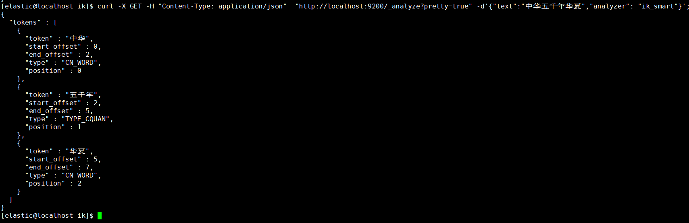

#### 1.2.2.2. ik_max_word分词

在JSON格式中添加**analyzer**节点内容为**ik_max_word**

~~~
[elastic@localhost elastic]$ curl -X GET -H "Content-Type: application/json"  "http://localhost:9200/_analyze?pretty=true" -d'{"text":"中华五千年华夏","analyzer": "ik_max_word"}';
~~~

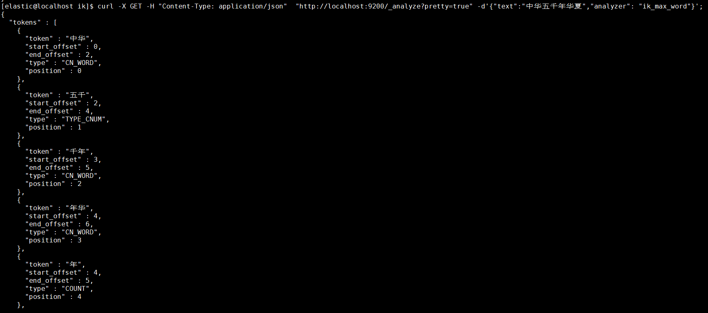

## 1.3. 索引

### 1.3.1. 创建索引

由于在ElasticSearch 7.x之后就默认不在支持指定索引类型，所以在在elasticsearch7.x上执行：
~~~
{
    "settings" : {
        "index" : {
            "number_of_shards" : 3, 
            "number_of_replicas" : 2 
        }
    },  
    "mappings" : {
        "twitter":{
            ......
        }
    }
~~~

执行结果则会出错：Root mapping definition has unsupported parameters（刚开始接触就踩了这个坑，折煞劳资好久）。如果在6.x上执行，则会正常执行。
出现这个的原因是，elasticsearch7默认不在支持指定索引类型，默认索引类型是_doc，如果想改变，则配置include_type_name: true 即可(这个没有测试，官方文档说的，无论是否可行，建议不要这么做，因为elasticsearch8后就不在提供该字段)。

https://www.elastic.co/guide/en/elasticsearch/reference/current/removal-of-types.html

#### 1.3.1.1. 官方例子说明

~~~

curl -X PUT "localhost:9200/twitter" -H 'Content-Type: application/json' -d'
{
    "settings" : {
        "index" : {
            "number_of_shards" : 3, 
            "number_of_replicas" : 2 
        }
    }
}
'
~~~

- -d指定了你的参数，这里将这些参数放到了json文件中

- settings设置内容含义

name | 价格 |
-|-|
number_of_shards | 分片数
number_of_replicas | 副本数
mappings | 结构化数据设置   下面的一级属性 是自定义的类型
properties | 类型的属性设置节点，下面都是属性
epoch_millis | 表示时间戳

#### 1.3.1.2. 自定义索引

- 使用json文件创建索引
使用 -d‘@your jsonFile’指定你的json文件。下边我创建了一个索引名称为product（可自己定义）的索引。

~~~

[elastic@localhost elastic]$ curl -H "Content-Type: application/json" -X PUT "http://localhost:9200/twitter?pretty=true"  -d'@prod.json'
~~~

- 参数形式创建索引

~~~
[elastic@localhost elastic]$ curl -H "Content-Type: application/json" -X PUT "http://localhost:9200/twitter?pretty=true"  -d'
{
    "settings" : {
        "index" : {
            "number_of_shards" : 3, 
            "number_of_replicas" : 2 
        }
    },  
    "mappings" : {
            "dynamic": false,
            "properties" : {
                "productid":{
                    "type" : "long"
                },  
                "name":{
                    "type":"text",
                    "index":true,
                    "analyzer":"ik_max_word"
                },  
                "short_name":{
                    "type":"text",
                    "index":true,
                    "analyzer":"ik_max_word"
                },  
                "desc":{
                    "type":"text",
                    "index":true,
                    "analyzer":"ik_max_word"
                }
            }
    }
}
'
~~~

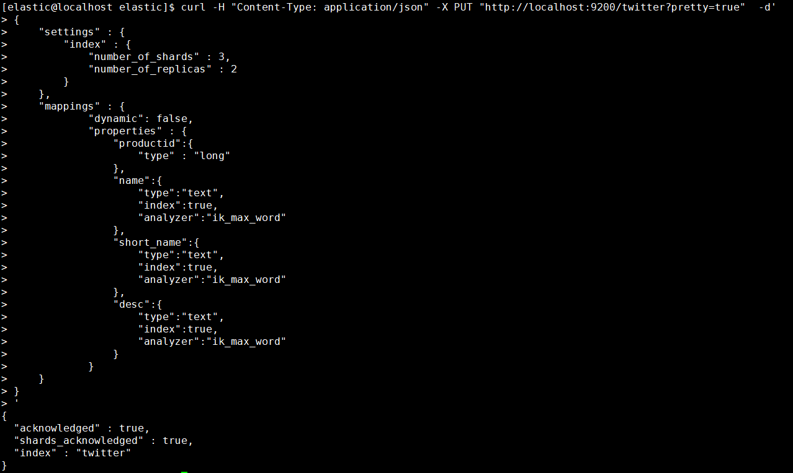

### 1.3.2. 查看索引

#### 1.3.2.1. 全部索引
~~~
[elastic@localhost elastic]$ curl -H "Content-Type: application/json" -X GET "http://localhost:9200/_cat/indices?v"
health status index   uuid                   pri rep docs.count docs.deleted store.size pri.store.size
yellow open   twitter scSSD1SfRCio4F77Hh8aqQ   3   2          0            0       690b           690b

~~~

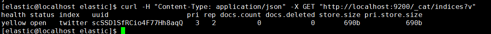

#### 1.3.2.2. 条件查询

~~~
[elastic@localhost elastic]$ curl -H "Content-Type: application/json" -X GET "http://localhost:9200/twitter?pretty=true"
{
  "twitter" : {
    "aliases" : { },
    "mappings" : {
      "dynamic" : "false",
      "properties" : {
        "desc" : {
          "type" : "text",
          "analyzer" : "ik_max_word"
        },
        "name" : {
          "type" : "text",
          "analyzer" : "ik_max_word"
        },
        "productid" : {
          "type" : "long"
        },
        "short_name" : {
          "type" : "text",
          "analyzer" : "ik_max_word"
        }
      }
    },
    "settings" : {
      "index" : {
        "creation_date" : "1571153735610",
        "number_of_shards" : "3",
        "number_of_replicas" : "2",
        "uuid" : "scSSD1SfRCio4F77Hh8aqQ",
        "version" : {
          "created" : "7040099"
        },
        "provided_name" : "twitter"
      }
    }
  }
}

~~~

### 1.3.3. 查看索引分词器

~~~
[elastic@localhost elastic]$ curl -H "Content-Type: application/json" -X GET "http://localhost:9200/twitter/_analyze?pretty=true" -d'
{
  "field": "text",
  "text": "秦皇汉武."
}
'
~~~

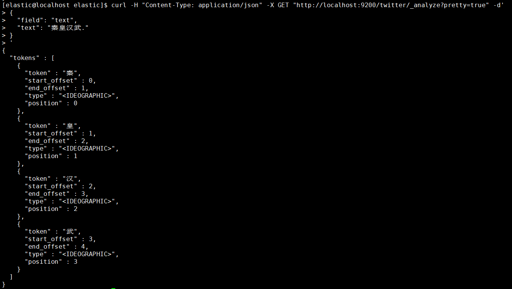

### 1.3.4. 修改索引

### 1.3.5. 删除索引

~~~
[elastic@localhost elastic]$ curl -H "Content-Type: application/json" -X DELETE "http://localhost:9200/twitter?pretty=true"
~~~

## 1.4. 如何数据管理

### 1.4.1. 添加数据

- 这里演示PUT方式为twitter索引添加数据，并且指定id，应当注意此处的默认类型为_doc，还有一种就是采用POST方式添加数据，并且自动生成主键，本文就不再演示，请自行查阅相关材料。

~~~
[elastic@localhost elastic]$ curl -H "Content-Type: application/json" -X PUT "http://localhost:9200/twitter/_doc/1?pretty=true" -d'
{
    "productid" : 1,
    "name" : "测试添加索引产品名称",
    "short_name" : "测试添加索引产品短标题",
    "desc" : "测试添加索引产品描述"
}
'
~~~

执行返回结果如图，则添加数据成功。
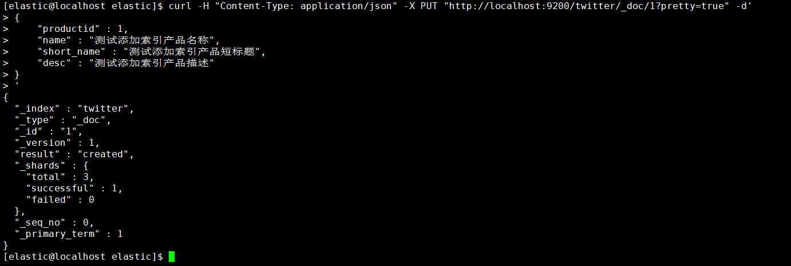

- 指定id为1，还可以加上参数op_type=create，这样在创建重复id时会报错导致创建失败，否则会更新该id的属性值。

~~~
[elastic@localhost elastic]$ curl -H "Content-Type: application/json" -X PUT "http://localhost:9200/twitter/_doc/1?op_type=create&pretty=true" -d'
{
    "productid" : 1,
    "name" : "测试添加索引产品名称",
    "short_name" : "测试添加索引产品短标题",
    "desc" : "测试添加索引产品描述"
}
'
~~~

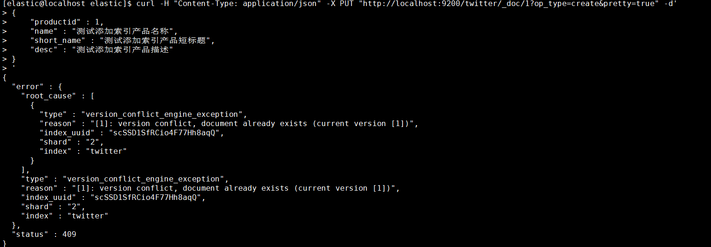

### 1.4.2. 基础查询

#### 1.4.2.1. 查询所有

~~~
[elastic@localhost elastic]$ curl -H "Content-Type: application/json" -X GET "http://localhost:9200/twitter/_search?pretty=true"
~~~

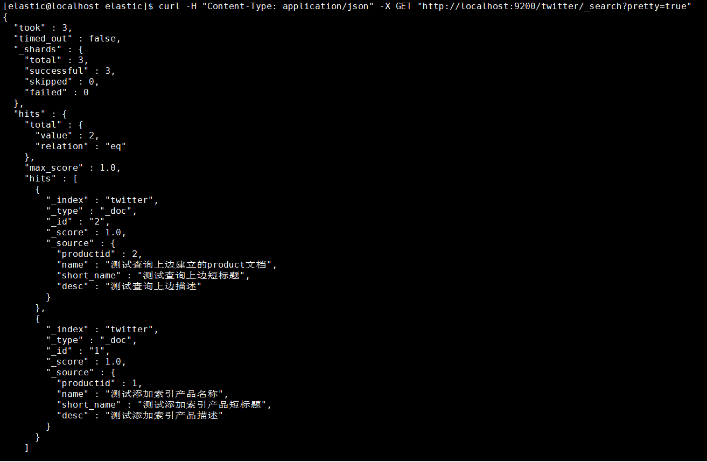

#### 1.4.2.2. 条件查询

条件查询会涉及到精确词查询、匹配查询、多条件查询、聚合查询四种，分别为"term"、"match"、"multi_match"、"multi_match"。

- 按找数据的名称作为条件查询匹配

~~~
[elastic@localhost elastic]$ curl -H "Content-Type: application/json" -X GET "http://localhost:9200/twitter/_search?pretty=true" -d'
{
    "query" : {
        "match" : { 
            "name" : "产品" 
        }
    }
}
'
~~~

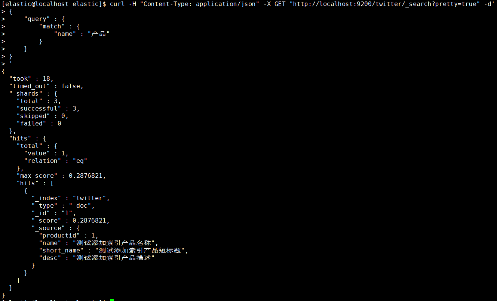

- 按找数据的标识作为条件查询匹配

~~~
[elastic@localhost elastic]$ curl -H "Content-Type: application/json" -X GET "http://localhost:9200/twitter/_search?pretty=true" -d'
{
    "query" : {
        "match" : { 
            "productid" : 100
        }
    }
}
'
~~~

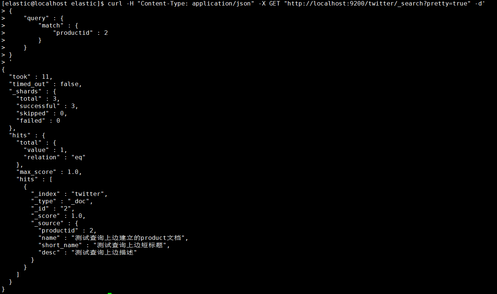

- 多条件匹配

选择匹配desc、short_name列作为多条件

~~~
[elastic@localhost elastic]$ curl -H "Content-Type: application/json" -X GET "http://localhost:9200/twitter/_search?pretty=true" -d'
{
    "query" : {
        "multi_match" : { 
            "query":"产品",
            "fields" : ["desc","short_name"]
        }
    }
}
'
~~~

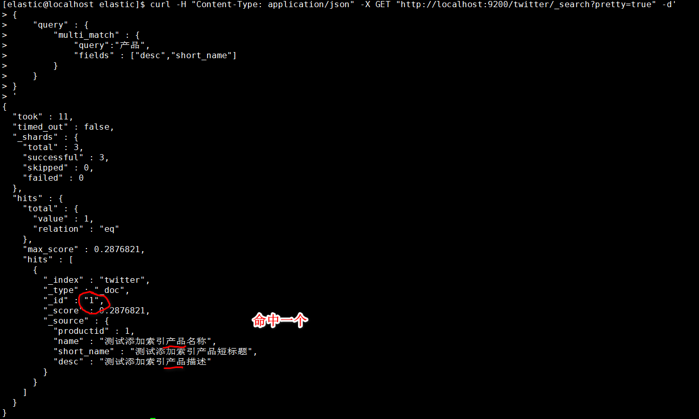

- 当没有匹配任何数据适合则如下：
~~~
[elastic@localhost elastic]$ curl -H "Content-Type: application/json" -X GET "http://localhost:9200/twitter/_search?pretty=true" -d'
> {
>     "query" : {
>         "match" : { 
>             "productid" : 100
>         }
>     }
> }
> '
{
  "took" : 1,
  "timed_out" : false,
  "_shards" : {
    "total" : 3,
    "successful" : 3,
    "skipped" : 0,
    "failed" : 0
  },
  "hits" : {
    "total" : {
      "value" : 0,
      "relation" : "eq"
    },
    "max_score" : null,
    "hits" : [ ]
  }
}
~~~

### 1.4.3. 高级条件查询

#### 1.4.3.1. 权重boost查询

指定一个boost值来控制每个查询子句的相对权重，该值默认为1。一个大于1的boost会增加该查询子句的相对权重。
索引映射定义的时候指定boost在elasticsearch5之后已经弃用。建议在查询的时候使用。

~~~
[elastic@localhost elastic]$ curl -H "Content-Type: application/json" -X GET "http://localhost:9200/twitter/_search?pretty=true" -d'
{
    "query": {
        "match" : {
            "title": {
                "query": "quick brown fox",
                "boost": 2
            }
        }
    }
}
'
~~~

#### 1.4.3.2. 过滤coerce查询

数据不总是我们想要的，由于在转换JSON body为真正JSON 的时候,整型数字5有可能会被写成字符串"5"或者浮点数5.0。coerce属性可以用来清除脏数据。
一般在以下场景中：

- 字符串会被强制转换为整数
- 浮点数被强制转换为整数

##### 1.4.3.2.1. 创建索引

~~~
[elastic@localhost elastic]$ curl -H "Content-Type: application/json" -X PUT "http://localhost:9200/wongs?pretty=true"  -d'
{
    "settings" : {
        "index" : {
            "number_of_shards" : 3, 
            "number_of_replicas" : 2 
        }
    },  
    "mappings" : {
            "properties" : {
                "col_1":{
                    "type" : "integer"
                },  
                "col_2":{
                    "type":"integer",
                    "coerce": false
                }
            }
    }
}
'
~~~

##### 1.4.3.2.2. 创建第一个数据

~~~
[elastic@localhost elastic]$ curl -H "Content-Type: application/json" -X PUT "http://localhost:9200/wongs/_doc/1?pretty=true" -d'
{
    "col_1" : "20"
}
'
~~~
结果为成功，说明col_1列数据没问题。

##### 1.4.3.2.3. 创建第二个数据

~~~
[elastic@localhost elastic]$ curl -H "Content-Type: application/json" -X PUT "http://localhost:9200/wongs/_doc/1?pretty=true" -d'
> {
>     "col_2" : "20"
> }
> '
{
  "error" : {
    "root_cause" : [
      {
        "type" : "mapper_parsing_exception",
        "reason" : "failed to parse field [col_2] of type [integer] in document with id '1'. Preview of field's value: '20'"
      }
    ],
    "type" : "mapper_parsing_exception",
    "reason" : "failed to parse field [col_2] of type [integer] in document with id '1'. Preview of field's value: '20'",
    "caused_by" : {
      "type" : "illegal_argument_exception",
      "reason" : "Integer value passed as String"
    }
  },
  "status" : 400
}

~~~

由于不能被格式化，数据新增失败。

#### 1.4.3.3. copy_to

copy_to允许你创造自定义超级字段_all. 也就是说，多字段的取值被复制到一个字段并且取值所有字段的取值组合, 并且可以当成一个单独的字段查询.
如，first_name和last_name可以合并为full_name字段。

##### 1.4.3.3.1. 定义索引

~~~
[elastic@localhost elastic]$ curl -H "Content-Type: application/json" -X PUT "http://localhost:9200/idx_copy_to?pretty=true"  -d'
{
    "settings" : {
        "index" : {
            "number_of_shards" : 3, 
            "number_of_replicas" : 2 
        }
    },  
    "mappings" : {
            "properties" : {
                "first_name":{
                    "type" : "text",
                    "copy_to": "full_name"
                },  
                "last_name":{
                    "type":"text",
                    "copy_to": "full_name"
                },
                "full_name":{
                    "type": "text"
                }
            }
    }
}
'
~~~

##### 1.4.3.3.2. 新增数据

~~~
[elastic@localhost elastic]$ curl -H "Content-Type: application/json" -X PUT "http://localhost:9200/idx_copy_to/_doc/1?pretty=true" -d'
> {
>     "first_name" : "jack",
>     "last_name" : "Rose"
> }
> '
{
  "_index" : "idx_copy_to",
  "_type" : "_doc",
  "_id" : "1",
  "_version" : 1,
  "result" : "created",
  "_shards" : {
    "total" : 3,
    "successful" : 1,
    "failed" : 0
  },
  "_seq_no" : 0,
  "_primary_term" : 1
}

~~~

##### 1.4.3.3.3. 查询数据

~~~
[elastic@localhost elastic]$ curl -H "Content-Type: application/json" -X GET "http://localhost:9200/idx_copy_to/_search?pretty=true" -d'
{
    "query" : {
        "match": {
            "full_name": { 
                "query": "jack Rose",
                "operator": "and"
            }
        }
    }
}
'
~~~

从下图中得知first_name和 last_name字段取值都被复制到 full_name 字段。
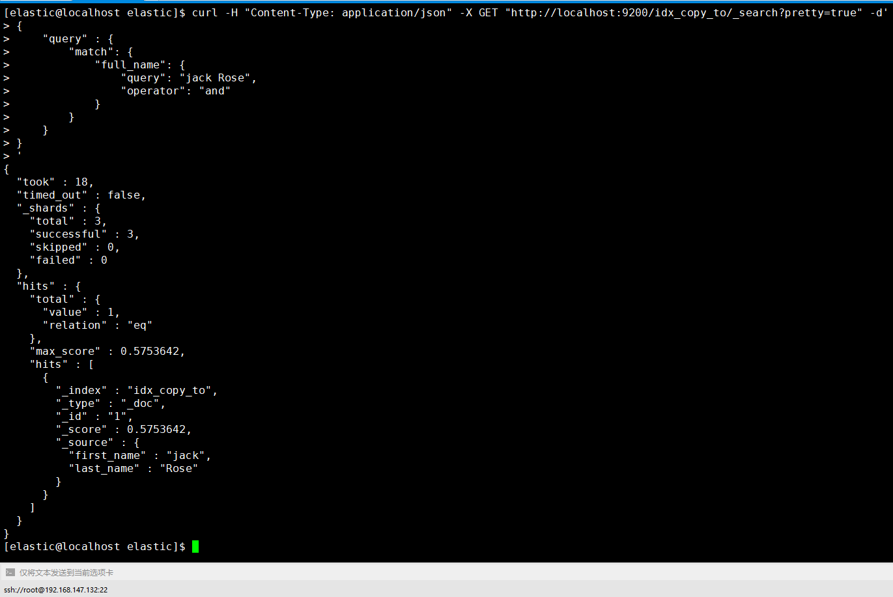

#### 1.4.3.4. doc_values

是为了加快排序、聚合操作，在建立倒排索引的时候，额外增加一个列式存储映射，是一个空间换时间的做法。默认是开启的，对于确定不需要聚合或者排序的字段可以关闭。

~~~
[elastic@localhost elastic]$ curl -H "Content-Type: application/json" -X PUT "http://localhost:9200/idx_doc_val?pretty=true"  -d'
{
    "settings" : {
        "index" : {
            "number_of_shards" : 3, 
            "number_of_replicas" : 2 
        }
    },  
    "mappings" : {
            "properties" : {
                "first_name":{
                    "type" : "text"
                },  
                "last_name":{
                    "type":"text",
                    "doc_values": false
                }
            }
    }
}
'
~~~

#### 1.4.3.5. dynamic

默认情况下，字段可以自动添加到文档或者文档的内部对象，elasticsearc也会自动索引映射字段。

~~~
[elastic@localhost elastic]$ curl -H "Content-Type: application/json" -X PUT "http://localhost:9200/idx_dynamic?pretty=true"  -d'
{
    "settings" : {
        "index" : {
            "number_of_shards" : 3, 
            "number_of_replicas" : 2 
        }
    },  
    "mappings" : {
            "properties" : {
                "first_name":{
                    "type" : "text"
                },  
                "last_name":{
                    "type":"text",
                    "doc_values": false
                }
            }
    }
}
'
~~~

# 2. 构建集群模式

# 3. 源码

[Github演示源码](https://github.com/king-angmar/weathertop/tree/master/akkad-springboot/springboot-elasticsearch) ，记得给Star